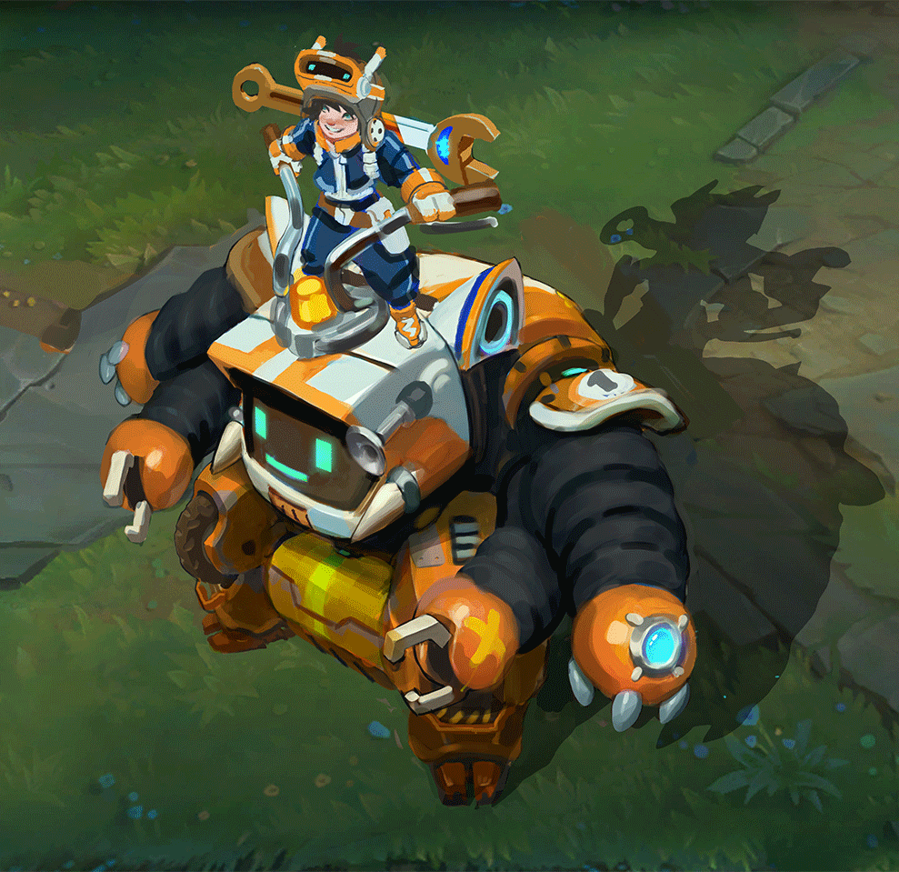

# Nunu & Willump Bot

An automated Bot that plays Teamfight Tactics for you while you sleep!

Pretty useful to farm pass tokens and get free skins, loot every reward of a pass, including prestige skin and prestige points!

# How to - N&W Bot

First of all clone this repository somewhere on your computer.

Then before starting the bot, be sure to install the required package;

```pip install -r Pipfile```

Once you installed packages you can run the bot with;

```python ./Willump.py```

When you init the script, the process didn't instantly start, you will see some text appear on your shell that'll introduce you to the bot's commands.

To make it work without problems, please respect the following conditions:

- Put your LOL Launcher in English
- Set it to 1600x900 resolution in the settings
- Once you are in-game, set the game window to 1600x900 Windowed

This should be sufficient to make the bot works.

# Explanations

When the bot is running please consider to do not use your computer. There is no particular reason for this. It's just, sometimes the script will take control over your mouse to auto-click and it can be disappointing for you to do something in those conditions. Also, the game window has to appear on your screen to make the bot working.

The bot is not developed to win games, but not developed to force losing them too, it's just built to spam them without taking the result into consideration. So, sometimes you could win, or lose, it's pure RNG.

The bot is developed to buy always the same troops, you can change it by updating the ``buy{id}.png`` in the assets/location directory. It's easy to do, take an in-game partial screenshot similar to the current ones, then change it with yours. When you update assets to match with the ones you want: be sure to have them in the same resolution. I mean, if your game is in 1920x1080, you change one asset, this asset will not work as expected due to the others which are not in this resolution.

# Credit

Author - Jolan Lacroix (https://vitri0l.github.io/about)
